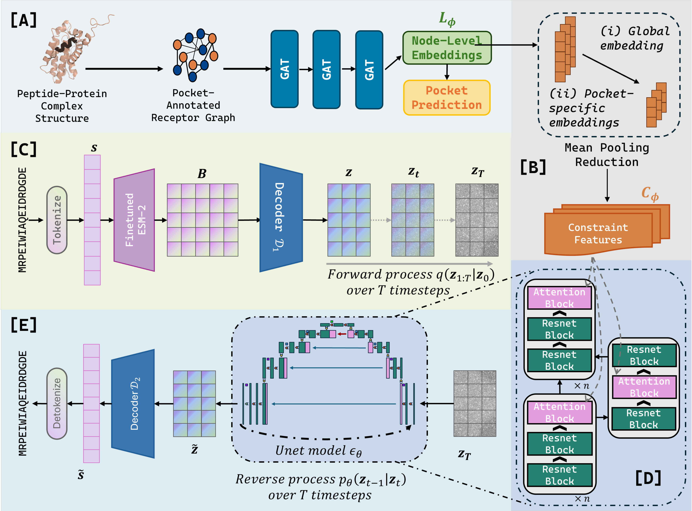
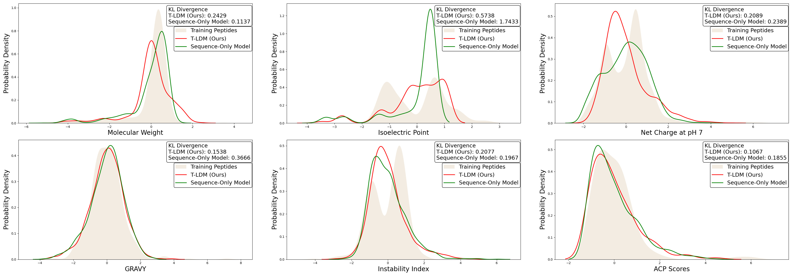

# 🧬 T-LDM: Target-Aware Latent Diffusion Model for Design of Apoptosis-Inducing Anticancer Peptides binding to BCL-xL.


<p align="center">


</p>
This repository contains a complete preprocessing and training pipeline for paper titled, "Enhancing Latent Diffusion Models with Graph Neural Networks for Binding Pocket-Aware Therapeutic Peptide Design".


## 📚 Table of Contents

- [Getting Started](#getting-started)
  - [⚙️ Anaconda Environment Setup Guide](#️-anaconda-environment-setup-guide)
  - [📁 Folder Structure](#-folder-structure)
  - [✅ Setup](#-setup)
  - [🧪 Verifying Installation](#-verifying-installation)
  - [🛠️ Troubleshooting](#️-troubleshooting)
  - [📌 Notes](#-notes)
- [🚀 Usage](#-usage)
  - [📂 Dataset and Saved Models](#-dataset-and-saved-models)
  - [Preprocessing the dataset](#preprocessing-the-dataset)
  - [Training and finetuning](#training-and-finetuning)
    - [🧪 Pretraining Mode](#-pretraining-mode)
    - [🔬 Finetuning Mode](#-finetuning-mode)
    - [Step 4: Train GNN Models](#step-4-train-gnn-models)
    - [Step 5: Train the Decoder Module](#step-5-train-the-decoder-module)
    - [Step 6: Train the Latent Diffusion Model](#step-6-train-the-latent-diffusion-model)
  - [Optional: Finetuning ESM model](#optional-finetuning-esm-model)
- [Data Analytics](#data-analytics)
- [📊 Logging & Evaluation](#-logging--evaluation)
- [🧠 Docking](#-docking)
- [📌 Citation](#-citation)


<!--

project-root/
├── YML_files/
│   ├── GNN_env.yml
│   └── LDM_env.yml
├── Decoder/
├── ├── train_decoder.py
|   └── ...
├── Diffusion/
├── ├── main_diff_TL.py
|   └── ...
├── GNN/
├── ├── train_GAT.py
|   └── ...
└── README.md
-->


## Getting Started
### ⚙️ Anaconda Environment Setup Guide

This project uses 2 conda environments stored as two YAML files located in the `YML_files` directory:

- `GNN_env.yml` → for training GNN models (GAT, GCN)
- `LDM_env.yml` → for the 2 stage decoder and latent diffusion model (LDM)

### 📁 Folder Structure

Ensure your `YAML` files are in the correct directory as below:

```
project-root/
├── YML_files/
│   ├── GNN_env.yml
│   └── LDM_env.yml
├── ...
...
└── README.md
```

### ✅ Setup

#### 1. Open Terminal and Navigate to the Project Directory

```bash
cd /path/to/your/project-root
```

#### 2. Create Conda Environment for GNN Model

```bash
conda env create --name train_gnn --file YML_files/GNN_env.yml
conda activate train_gnn
```

#### 3. Create Conda Environment for Decoder and Diffusion Model

```bash
conda env create --name acp_diff --file YML_files/LDM_env.yml
conda activate acp_diff
```

### 🧪 Verifying Installation

```bash
conda list
conda env list
```

Expected environments:
```
train_gnn      /path/to/anaconda3/envs/train_gnn
acp_diff       /path/to/anaconda3/envs/acp_diff
```

### 🛠️ Troubleshooting

 If you see build errors, try:
  ```bash
  conda env create --name train_gnn --file YML_files/GNN_env.yml --no-builds
  ```
To remove an existing env:
  ```bash
  conda remove --name train_gnn --all
  ```

### 📌 Notes

- Ensure Conda is installed and `conda` is accessible in your terminal.
- DSSP (via `mkdssp`) must be installed and available in your `PATH` for some scripts.

---

## 🚀 Usage
### 📂 Dataset and Saved Models

This project uses two key datasets: **BioLiP** and **ACP–BCL-xL**. The model is first **pretrained on the BioLiP dataset**, which provides a wide range of protein–peptide complexes for learning structural interaction patterns. It is then **fine-tuned using the ACP–BCL-xL dataset**, a curated set of anticancer peptides targeting the BCL-xL protein, enabling domain-specific adaptation.

All datasets, edge index files, and **saved model checkpoints** can be accessed from the following shared folder:  
🔗 [Project Files Repository](https://entuedu-my.sharepoint.com/:f:/g/personal/s230112_e_ntu_edu_sg/EhKSWfE1ADVGktbXBSLdXuAB9tPWlhoUvGqEpDqG3EtXcg?e=X6ab6K)

Prior to preprocessing, model training and inference mode, please download all required files and add them into their respective folders.

#### 🧠 Saved Models

The shared folder also contains pretrained and fine-tuned model weights for the following components:

- **GAT Model** (Graph Attention Network) for extracting global and pocket-specific structural embeddings
- **GCN Model** (Graph Convolutional Network) as an ablation baseline for pocket representation
- **Two-Stage Decoder**:
  - Stage 1: Latent embedding projection from ESM-2
  - Stage 2: Amino acid sequence decoding from latent space
- **Latent Diffusion Model (LDM)**: A structure-aware diffusion framework for peptide generation conditioned on PLM and GNN-derived features


### Preprocessing the dataset

Note: Please Skip preprocessing if `edge_indexes_train_test.pt` and `edge_indexes.pt` are available.

Preprocessing (Step 1 to Step 3) is performed for both the ACP finetuning dataset and the BioLiP pretraining dataset, and the resulting graphs are used for conditioning the generative model.

Prior to preprocessing, please down all required files from the link provided and ensure your directory looks like this under the GNN folder:

```
project-root/
├── GNN/
├── ├── train_data/
├── ├── docking_results/
├── ├── BioLiP.txt
├── ├── train_GAT.py
├── ├── peptide_data.csv
|   └── ...
└── README.md
```
Please ensure `peptide_data.csv` is in the correct directory as this contains the BCL-xL peptide dataset for preprocessing. Note that step 1 and 2 is preprocessing for BCL-XL dataset while step 3 processes both the BCL-XL and BioLiP dataset into `.pt` files.

#### Setup
Before running any preprocessing or training scripts, make sure to **update the file paths** to match the location of your datasets on your own system.

For example, in some scripts you will see:

```python
OUTPUT_FILE = "features.pt"
STRUCTURE_FOLDER = "/home2/s230112/BIB/GNN/docking_results/"  # Folder containing all the bonded complexes
BclxL_XLSX_FILE = "/home2/s230112/BIB/GNN/input_features.csv"
```
You should modify the `STRUCTURE_FOLDER` and `BclxL_XLSX_FILE` paths to match the absolute or relative location of your downloaded dataset. For instance, if you downloaded and placed the files in `/home/user/peptide_project/data/`, you should change the code to:

```python
STRUCTURE_FOLDER = "/home/user/project_name/GNN/docking_results/"
BclxL_XLSX_FILE = "/home/user/project_name/GNN/input_features.csv"
```

#### 1. **Extract Binding Site Info**


```bash
python extract_pocket_loc.py
```
- Input: `peptide_data.csv` with PDB IDs.
- Output: `input_features.csv` with receptor/ligand chains, sequences, and pocket residue indices.

---

#### 2. **Preprocess Features**

```bash
python edit_data_preprocessing.py
```
- Input: `input_features.csv` and PDB files.
- Output: `features.pt` — per-residue graph node features and labels.

---

#### 3. **Build Edge Indices**

```bash
python edge_index.py
```
- Input: Same complexes as step 2.
- Output: `edge_indexes.pt` for BCL-xL dataset finetuning.

Prior to running the code below, please ensure `BioLiP.txt` is in the correct directory.

```bash
python edge_index_train.py
```
- Input: BioLiP.txt metadata + BioLiP PDB files.
- Output: `edge_indexes_train_test.pt` for BioLiP dataset pretraining.

---

### Training and finetuning

Step 4 to Step 6 cover model training. These include training a GNN (GAT or GCN) to encode structural binding context (Step 4), a two-stage decoder to map PLM embeddings into a latent space (Step 5), and finally, a latent diffusion model for peptide sequence generation constrained by structure-aware embeddings (Step 6).

In **Step 5 (Decoder training)** and **Step 6 (Diffusion model training)**, you can specify whether to run the model in **pretraining** or **finetuning** mode using the `--phase` argument.

#### 🧪 Pretraining Mode
To train the model on the **BioLiP** dataset, set the phase to `pretrain`:

```bash
python Decoder/train_decoder.py --phase pretrain
python Diffusion/main_diff_TL.py --phase pretrain
```

This will initialize the models from scratch and train them using BioLiP data.

#### 🔬 Finetuning Mode
To finetune the model on the **BCL-xL ACP** dataset after pretraining, set the phase to `finetune`:

```bash
python Decoder/train_decoder.py --phase finetune
python Diffusion/main_diff_TL.py --phase finetune
```

This will **load the pretrained model** from the BioLiP phase and continue training it with the target ACP data.  
⚠️ **Important:** Ensure the pretrained model checkpoints are available before initiating finetuning.


#### Step 4: **Train GNN Models**

Running these python scripts will automatically perform both pretraining and finetuning for their GNN models as well as creating the embedding pockets for constraint integration for the diffusion model.

##### (a) GAT-based Model
```bash
python train_GAT.py
```
- Pretrains on BioLiP, then fine-tunes on BCL-xL data.
- Saves:
  - `model_pretrained_coordinate_abalation_test.pth`
  - `model_finetuned_coordinate_abalation_test.pth`
  - `resulting_embeddings_final_[biolip|acp]_test.pt`
  - `resulting_embeddings_final_pocket_[biolip|acp]_test.pt`

##### (b) GCN-based Model (Ablation Study)
```bash
python train_GCN.py
```
- Same setup as above, but using GCNConv layers.
- Output files follow the same structure with `GCN_` prefix.


#### **Step 5: Train the Decoder Module**

To train the 2 stage decoder model, the conda environment `acp_diff` has to be activated first. Ensure that you have set the model to either pretrain or finetune mode.

```bash
conda activate acp_diff
python Decoder/train_decoder.py
```

- Input: ESM-2 embeddings
- Output: `[decoder_name]_acp.pt` or `[decoder_name]_biolip.pt` (saved model checkpoints)

#### **Step 6: Train the Latent Diffusion Model**

Please ensure that the GNN embeddings `resulting_embeddings_final_pocket_biolip.pt` or `resulting_embeddings_final_pocket_acp.pt` are prepared beforehand, along with the pretrained decoder `.pt` file, before executing the diffusion model.

To speed up the execution by skipping the data loading phase (which can be time-consuming), you may retrieve the preprocessed datasets `biolip_processed_data.npz` and `ACP_processed_data.npz` from the provided shared link. Place them in the project root directory. If present, the script will automatically bypass the data loading.

To run the diffusion model, activate the conda environment and execute the following:

```bash
conda activate acp_diff
python Diffusion/main_diff_TL.py
```

Input:
- ESM-2 embeddings
- GNN embeddings (either global or pocket-specific)
- Pretrained decoder `.pt` file

Output:
- Trained diffusion model
- Generated peptide sequences
- Physicochemical properties of generated peptides (Molecular weight, Isoelectric point)

After training, the model will be saved under the `result_constrained_v2` directory as `[model_name]_acp` or `[model_name]_biolip` depending on the training mode used (`--phase finetune` for ACP or `--phase pretrain` for BioLiP). Upon completion of training, the model will proceed directly into inference mode. Newly generated peptide sequences will be saved in the `generated_constrained_v2` folder.

The corresponding physicochemical properties of the generated sequences will also be computed and stored in the `result_constraint_properties` folder, along with evaluation metrics such as BLEU and Perplexity.

### Optional: Finetuning ESM model
This section is completely optional, however if you wish to finetune the ESM model do refer to the content below. Else, we have a fine tuned model available in the shared link.

The python script `finetune_esm.py` performs a two-stage fine-tuning of the ESM-2 protein language model using masked language modeling (MLM). The first stage fine-tunes on BioLiP sequences, and the second stage fine-tunes on ACP sequences, both using a masked token prediction objective.

The script uses Hugging Face Transformers for model loading and training, and integrates wandb for experiment tracking.

The main training script is defined in `main()` with argument parsing support. To run the script:

```bash
conda activate acp_diff
python train_finetune_esm.py \
  --model_name facebook/esm2_t33_650M_UR50D \
  --biolip_csv biolip_pepseq_pdbid.csv \
  --acp_csv ori_peptide_data.csv \
  --device cuda \
  --biolip_output fine_tuned_esm2_biolip \
  --acp_output fine_tuned_esm2_acp \
  --biolip_epochs 5 \
  --acp_epochs 5 \
  --batch_size 8 \
  --lr 2e-5 \
  --max_length 64 \
  --mask_prob 0.15
```

Description:
1. The `BioMLMDataset` class handles reading sequences from CSV and applying dynamic token masking for MLM.
2. The `train_esm_mlm` function handles model training and evaluation logging to wandb.
3. Only the final transformer layer and the LM head are unfrozen for training (using `freeze_all_except_last_layer()`).
4. The fine-tuned model is saved after each epoch and finally at the end of training.
5. Output checkpoints are saved under `fine_tuned_esm2_biolip` and `fine_tuned_esm2_acp`.

WandB logging is active, so ensure your environment is authenticated or use `wandb login`.

Final trained ACP-specific ESM model is stored in the directory passed to `--acp_output`.

---

## Data Analytics
Once new peptide sequences have been generated, you can evaluate their statistical properties by comparing the distributions of key metrics with those of the training data using KL divergence.

To begin, run `acps_and_instb_calc.py` to compute the ACP scores and instability index for the generated peptides. Then, execute `distribution_curve.py` to visualize the distribution curves and compute the KL divergence across relevant metrics.

Before running the scripts, make sure to update all directory paths inside both Python files to match your project structure.


<p align="center">


</p>

The plots generated will compare Molecular weight, Isoelectric point, Net charge at pH 7, GRAVY, Instability Index, and ACP scores between the generated peptide and training data peptide as shown in the image above.

---
## 📊 Logging & Evaluation

- All Training logs and metrics (Eg. loss, accuracy, AUC-ROC) are tracked with [Weights & Biases](https://wandb.ai/). Please ensure you have have setup wandb prior to running this project.
- Model files, Graphs plots and embedding extraction are saved automatically.

---

## 🧠 Docking

HADDOCK3 was used for docking the generated peptides onto BCL-XL (PDB ID: 4QVE).
Instructions on how to use HADDOCK3 can be found here: [HADDOCK3](https://www.bonvinlab.org/software/haddock3/)

---

## 📌 Citation

If this code contributes to your research, please consider citing our work (manuscript submitted to *Briefings in Bioinformatics*).
